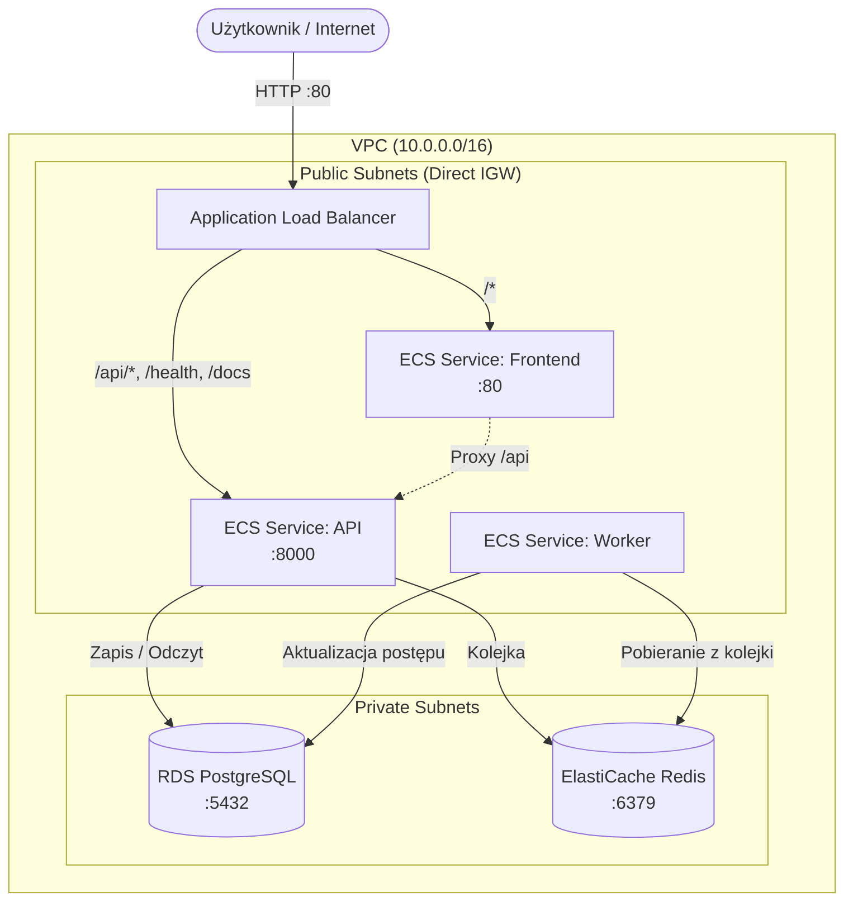

# AWS ECS Fargate Infrastructure (Terraform)

Kod Terraform do wdrożenia architektury mikrousługowej na platformie **AWS ECS Fargate**.
Wdrożenie opiera się w 100% na **natywnym grafie zależności Terraform** (`depends_on` oraz referencjach zasobów), co gwarantuje poprawną kolejność tworzenia bez żadnych skryptów opakowujących.

---

## Architektura infrastruktury



---

## Wymagania wstępne
1. Zainstalowany **Terraform** (`>= 1.5.0`).
2. Skonfigurowane poświadczenia AWS CLI (`~/.aws/credentials` lub zmienne środowiskowe `AWS_ACCESS_KEY_ID` i `AWS_SECRET_ACCESS_KEY`).
3. Zbudowane i wypchnięte obrazy na Docker Hub (`training-api`, `training-worker`, `training-frontend`).

---

## Uruchomienie (Natywny Terraform)

### 1. Inicjalizacja:
```bash
cd terraform
terraform init
```

### 2. Sprawdzenie planu zmian:
```bash
terraform plan
```

### 3. Wdrożenie infrastruktury:
```bash
terraform apply
```

Terraform automatycznie zachowa poprawną kolejność tworzenia dzięki zdefiniowanym zależnościom:
1. VPC, podsieci, Security Groups, Internet Gateway.
2. IAM Role & Policies (`ecs_execution` attachment) oraz grupy logów CloudWatch.
3. Baza RDS PostgreSQL oraz klaster ElastiCache Redis.
4. Application Load Balancer, Listener oraz Listener Rules.
5. Task Definitions i serwisy ECS Fargate (uruchamiane dopiero po pełnej gotowości bazy, kolejki i load balancera).

Po zakończeniu wdrożenia adres URL aplikacji wyświetli się w outputach:
```text
application_url = "http://training-app-dev-alb-XXXXX.eu-central-1.elb.amazonaws.com"
api_swagger_url = "http://training-app-dev-alb-XXXXX.eu-central-1.elb.amazonaws.com/docs"
```

### 4. Sprzątanie zasobów:
```bash
terraform destroy
```
